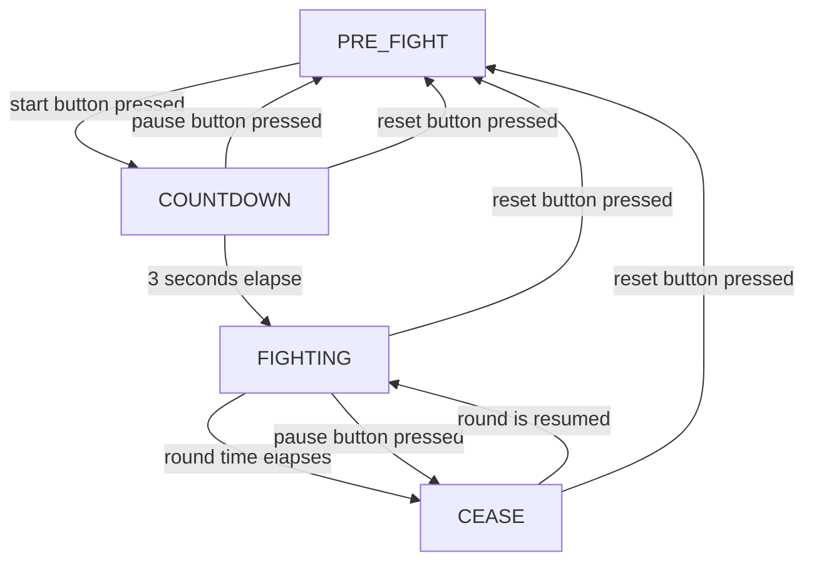
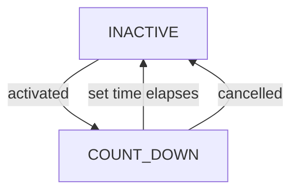

# Cobat Robotics Clock System (CRoCS)
CRoCs is a highly-configurable arduino-based clock and timer system for combat robotics events.
It's state-based with program-configurable lighting & count-down systems, designed for easy customisation and optional run-time configurable match lengths.

By default, the state control flow is as follows:

While in the `FIGHTING` state, secondary timers can be configured to be activated for pinning, pits and other special events.
Each timer has the following state control flow:

