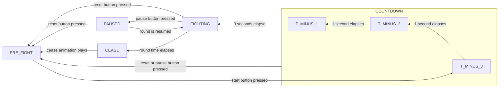

Configuration Guide
===================

### Overview
The program consists of one or more state machines - one for the control flow of the round, and the rest acting as timers.
Each state can be associated with any number of effects classes, which control arbitrary audio/visual effects for the duration of that state.

While the homepage shows the COUNTDOWN as a single state, in reality, it is actually composed of 3 states:

This makes it possible to set colours for each of the countdown stages independantly.

### Example
For example, an instance of the "RGBLightsToColour" class could be associated with the `PAUSED` state, and configured to set a number of RGB lights to the colour red.
Now, when in this state, the instance of RGBLightsToColour will be triggered, allowing it the opportunity to change output states - here to set a number of RGB lights to the colour red.

```
PAUSED_STATE_EFFECTS = {RGBLightsToColour(R_PIN, G_PIN, B_PIN, 255, 0, 0)};
```

### Other Examples (TODO: Sort out)
```
// State-button action configuration
PAUSED_STATE_BUTTON_TRANSITIONS = {
                                    ButtonListener(PAUSE_BUTTON, FIGHTING), // If the pause button is pressed again, go back to fighting
                                    ButtonListener(RESET_BUTTON, PRE_FIGHT) // If the reset button is pressed, go to PRE_FIGHT
                                  };
```
